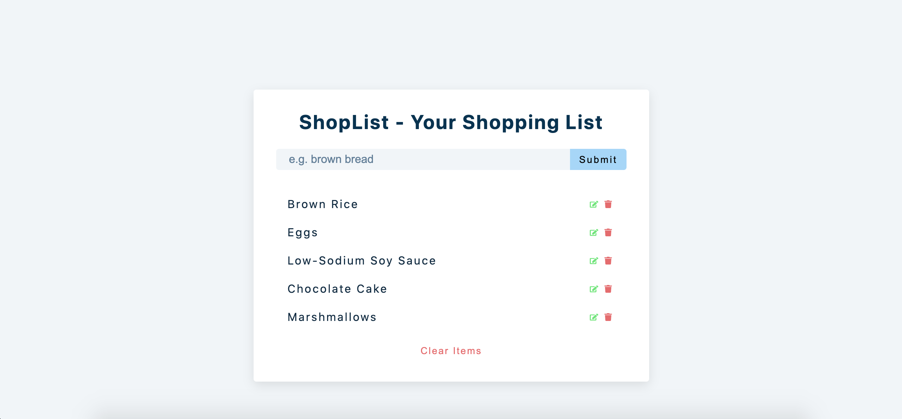

# ShopList

A Shopping List app with local storage - built in React.

## My process

### Built with

- Semantic HTML5 markup
- CSS custom properties
- CSS Grid & Flexbox
- JavaScript
- React.js ⚛️

<a href="https://developer.mozilla.org/en-US/docs/Glossary/HTML5" target="_blank" rel="noreferrer"></a>

### What I learned

In this project, I continued my learnings with handling forms in React. It's a pretty simple app but the functionality has been tough to figure out. I had to manage a lot of state variables to make all the component & functionality work.

It's also my first time working with Local Storage in browsers. And it's something that I'd love to discover more & build more apps with local storage.

A lot of useState & useEffect practice in this project. And I got to work with UUID package once again.

There were a lot of roadbloacks while working on this project, most about what should go where. But, I'm really satisfied with how I've managed to get it done.

### Demo

[Demo](https://webster-shoplist-app.netlify.app/)

### Screenshot:

---

### UUID

[UUID](https://github.com/uuidjs/uuid)

### Flaticon

[Flaticon](https://www.flaticon.com/free-icons/)

### React Icons

[React Icons](https://react-icons.github.io/react-icons/)
